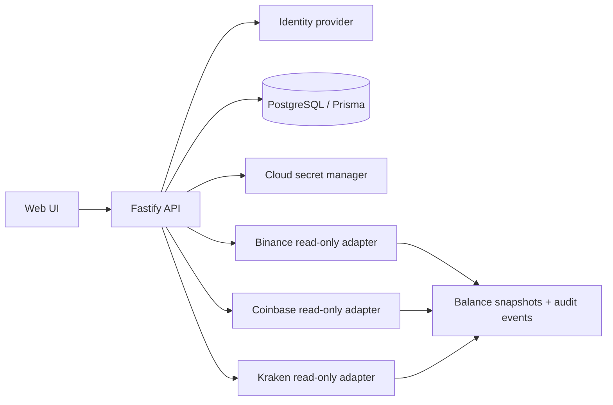

# Asteria backend architecture

## Boundaries

The browser only talks to the authenticated API. It never receives exchange secrets, model keys, or database credentials. The API authenticates the user, applies rate limits, loads encrypted credentials, decrypts them in memory for one exchange call, and immediately discards them.

The database stores ciphertext, not plaintext secrets. `APP_ENCRYPTION_KEY` is supplied by a cloud secret manager and must not be committed. Rotate it with a versioned key-encryption-key scheme before production.

## Data flow

## Production deployment

Deploy the container to a private cloud network behind TLS termination and an API gateway. Keep PostgreSQL private, enable encrypted backups and point-in-time recovery, restrict the service account to the secrets it needs, and ship logs to an immutable sink. Configure CI to build and scan the image, apply Prisma migrations as a one-shot deployment job, then roll out the API with health checks.

Before any live order endpoint is considered, add MFA, per-user exchange permission checks, maximum notional and daily loss limits, stale quote/slippage checks, idempotency keys, order reconciliation, manual approval, and a kill switch. The current `/v1/orders` route intentionally returns `403`.